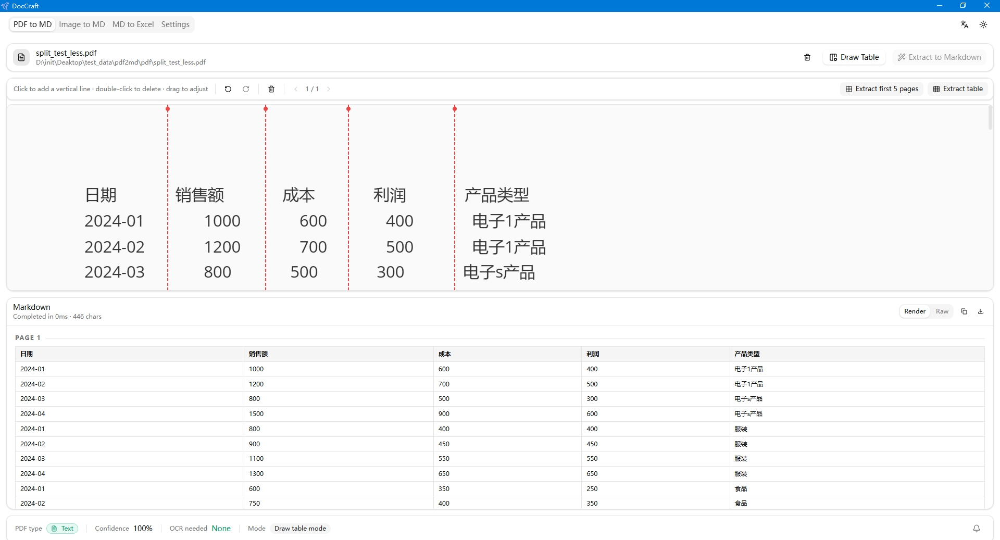
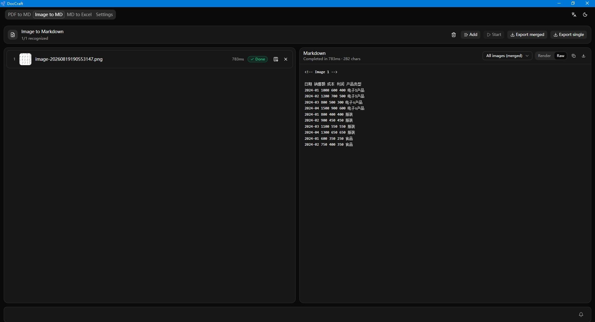
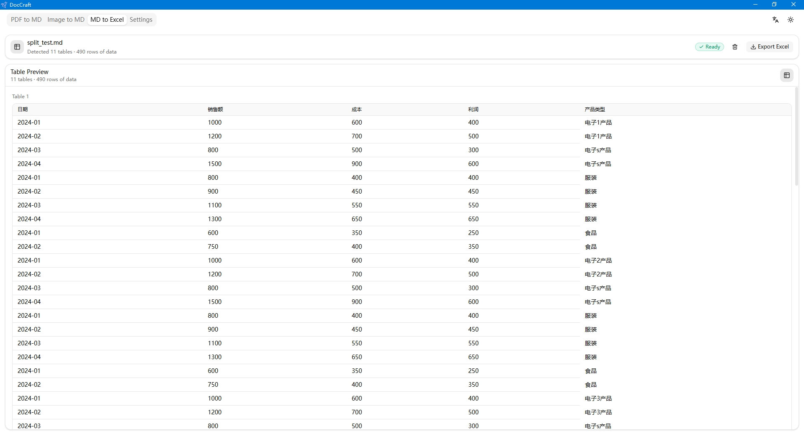
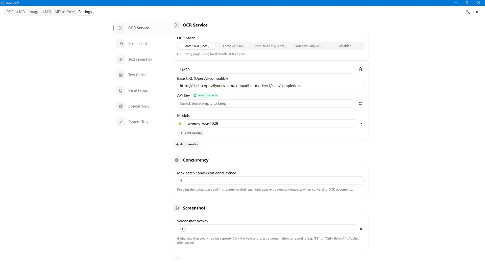

# DocCraft

English | [简体中文](./README_ZH.md)

A cross-platform **PDF → Markdown**, **Image → Markdown**, and **Markdown → Excel** desktop converter with built-in **screenshot OCR**, built with [Tauri 2](https://tauri.app), React, TypeScript, [shadcn/ui](https://ui.shadcn.com) and [`pdf-inspector`](https://crates.io/crates/pdf-inspector) (Firecrawl's pure-Rust PDF classification / extraction engine). The UI is bilingual — English (default) and Simplified Chinese — switchable at runtime.

> Detailed architecture & data-flow docs: [docs/index.md](./docs/index.md)

## Highlights

- ⚡ **Fast extraction** — pure-Rust text-layer extraction via `pdf-inspector` (no browser engine, no network): typical text PDFs convert in milliseconds.
- ✏️ **Draw-a-table extraction** — draw vertical / horizontal separator lines over a PDF page or imported image to cut tables exactly where you want them.
- 🧠 **Smart text merging** — configurable paragraph policy (Guided / Smart / None) joins wrapped OCR / text lines into clean paragraphs while keeping tables, lists and headings intact.
- 🎯 **Region exclusion** — draw rectangles over headers, watermarks or page numbers to suppress unwanted content before conversion.
- 📐 **Paddle layout analysis** — the bundled **PP-DocLayoutV3** DETR model (MNN) restores reading order for OCR pages, preserving skewed / multi-column layouts.
- 🔌 **Offline PaddleOCR** — the built-in local PaddleOCR engine (`ocr-rs`) runs fully on-device: scanned pages are recognized with zero network access and data never leaves the machine.

## Screenshots








## Features

### PDF → Markdown
- **Hybrid text + OCR** — text pages extracted locally by `pdf-inspector`; scanned / image-only pages rendered to PNG and sent to a configured OCR provider (remote AI vision or local PaddleOCR), then reassembled in document order.
- **Smart PDF routing** — each PDF is classified (~10–50ms) as `TextBased` / `Scanned` / `ImageBased` / `Mixed` with the exact list of pages needing OCR. Pure-text PDFs never touch the network.
- **Offline PaddleOCR** — the built-in local PaddleOCR engine (`ocr-rs`) runs fully on-device with no network required; scanned pages are recognized on a resident engine (toggleable cache) with per-page confidence scores.
- **Paddle layout analysis** — for OCR pages, the bundled **PP-DocLayoutV3** DETR model (MNN) detects reading order and region structure, so multi-column / skewed scans keep their original layout; degrades gracefully to plain Y→X sorting when the model is missing.
- **Region exclusion** — draw rectangles over headers, watermarks or page numbers to suppress unwanted content; apply per-page or to all pages at once, in both direct conversion and draw-table extraction.
- **Smart text merging** — a configurable paragraph policy (**Guided** / **Smart** / **None**) decides how extracted lines are joined: wrapped lines merge into clean paragraphs while tables, lists and headings stay intact. Screenshot OCR results follow the same policy.
- **Configurable OCR providers** — any OpenAI-chat-completions-compatible vision API (multiple vendors, multiple models per vendor) or the built-in local PaddleOCR engine. API keys are encrypted at rest (DPAPI on Windows) and never exposed to the frontend. A unified **OCR mode** selector offers five options: `ForceLocal`, `ForceAi`, `NonTextLocal`, `NonTextAi`, `Disabled`.
- **Graceful OCR fallback** — when no OCR provider is available, conversion still completes: pages needing OCR are skipped with `<!-- OCR skipped -->` comments. Per-page failures degrade to `<!-- OCR failed -->` comments. A bell icon in the status bar collects these as structured notices with clickable page chips and retry actions.
- **Draw-a-table extraction** — manually draw vertical and horizontal separator lines over a rendered PDF page to define table regions, then extract them into Markdown. Supports undo/redo, per-page lines, "apply to all pages" mode with a page limit, and OCR fallback for scanned pages (local PaddleOCR block cutting or remote AI vision with drawn-line hints).
- **Batch queue** — drag & drop many PDFs, worker-pool conversion with a user-configurable concurrency limit (1–16), retry / remove / export-all.
- **Editor workspace** — toolbar (convert), split view (PDF preview | Markdown preview), status bar (type / pages / confidence / OCR needs / notices bell).

### Image → Markdown
- Dedicated workspace tab accepting PNG / JPEG images via drag & drop or file picker, with deduplicated list and thumbnails.
- Each image is recognized by the OCR engine selected by the current **OCR mode** (local PaddleOCR or remote AI vision).
- Results are previewed as a merged GFM document and can be exported per-image or merged into a single `.md` file.
- **Draw-table on images** — imported images can be opened in a draw-table overlay where you draw vertical lines, then the image + line positions are sent to the backend for column-based extraction (local PaddleOCR text blocks
  + column cutting, or AI vision with line hints, depending on the OCR mode).

### Screenshot OCR
- Press the global hotkey (default `F8`) or use the tray menu to start a screen capture; a per-monitor overlay with magnifier lets you pick any screen region.
- The selected region is recognized by the engine chosen by the current **OCR mode**: local PaddleOCR runs on a dedicated engine instance that never queues behind batch jobs, or it goes to remote AI vision.
- Results follow the selected **paragraph mode** and OCR text cleanup (zero-width character stripping, whitespace collapsing, CJK ↔ Latin spacing
  normalization).
- Results appear in a glassmorphism popup window with pin-on-top, copy-to-clipboard and close actions, optional auto-copy, adjustable opacity, and the window position is remembered between sessions.

### Markdown → Excel
- Drop or pick `.md` files; each is parsed for GitHub-Flavored Markdown tables.
- Inline table preview with table/row counts, single or bulk export to `.xlsx`.
- Configurable **tables-only** mode: exports only GFM tables; when off, the whole document content is written into the workbook.
- Optional **strip Markdown syntax** (`**bold**`, `` `code` ``, links) and **numeric cells** so numbers sort and sum; sample tables inside code fences
  are never exported.
- Each table is labeled with its source PDF page (`Page N`) when produced by this app's PDF conversion.

### Performance & memory
- **Per-page OCR streaming** — the frontend renders and uploads one page at a time; peak memory stays at a single page image instead of the whole document.
- **Virtualized PDF preview** — only pages near the scroll viewport are rendered to canvas; off-screen bitmaps are released.
- **Lazy Markdown / Excel preview** — paginated rendering and windowed rows for large documents.
- **State-preserving tabs** — switching between tabs keeps every view mounted (hidden, not unmounted), so loaded files, results and queues survive tab switches.

### System tray
- System tray icon with right-click menu (Open, Start Screenshot, Exit) and left-click to show the main window. Close button hides to tray instead of
  quitting. Configurable in Settings.

## Getting Started

Prerequisites: Node ≥ 20, pnpm ≥ 10, Rust ≥ 1.85.

```bash
pnpm install       # install frontend deps
pnpm tauri dev     # run the desktop app
pnpm tauri build   # package the project
```

Useful checks:

```bash
pnpm exec tsc --noEmit               # frontend type check
pnpm build                           # frontend production build
cargo check --manifest-path src-tauri/Cargo.toml
```

## Model Conversion

The bundled layout model (**PP-DocLayoutV3**, MNN) is converted from the original PaddlePaddle inference model via the pipeline documented in [script/README.md](./script/README.md): `Paddle (inference.json / .pdmodel + .pdiparams) → ONNX → MNN`.

Pre-converted MNN weights are published on ModelScope: [tansen87/PP-DocLayoutV3_mnn](https://www.modelscope.cn/models/tansen87/PP-DocLayoutV3_mnn/files) — you can download them directly instead of converting on your own.

### Installing a model

Each layout model lives in its own subdirectory named after the model, containing the MNN weights and its `layout-meta.json`:

```
<resources>/models/layout/
└─ PP-DocLayoutV3/
   ├─ PP-DocLayoutV3.mnn
   └─ layout-meta.json
```

In **build mode** the resources are mirrored to `doccraft_resources/models/layout/` next to the executable (Tauri copies `src-tauri/resources/` to `<target>/<profile>/doccraft_resources/`, see `src-tauri/build.rs`), so a manually installed model goes to:

```
doccraft_resources/models/layout/PP-DocLayoutV3/PP-DocLayoutV3.mnn
doccraft_resources/models/layout/PP-DocLayoutV3/layout-meta.json
```

The engine discovers any directory under `models/layout/` that contains a valid `layout-meta.json` — dropping a new directory is enough, no code change needed. See `src-tauri/resources/models/layout/README.md` for the `layout-meta.json` format.

## Configuration

- `ocr-config.json` — per-vendor name, base URL, protected API key, models.
- `app-settings.json` — `maxConcurrent`, `cacheExtractedText`, `excelTablesOnly`, `stripMdSyntax`, `writeNumeric`, `ocrMode`, `screenshotHotkey`,
  `snipResultPopup`, `snipAutoCopy`, `snipResultOpacity`, `enableTray`, `textSeparator`, `paragraphMode`, `ocrTextCleanup`, `ocrLayoutMode`,
  `ocrLayoutModel`, `layoutScoreThreshold`.

## License

MIT